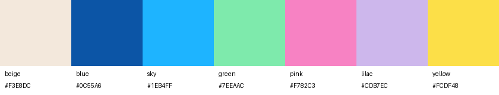

# gen now branding: what was taken from gennow.de and where it went

Source: https://gennow.de/, read on 26.09.2026 (home page, its stylesheet, and `/wirtschaft/young-founders-network/`). Reference screenshots and the logo files are in `docs/brand/`.

## What the site uses

| Element | On gennow.de | Evidence |
|---|---|---|
| Logo | "gen" in black + hand-lettered "now" in blue `#0C55A6` | `logo-gen-now.svg` (theme upload) |
| Parent brand | "Ein Projekt der" + Bertelsmann Stiftung wordmark (blue bar, "Bertelsmann" light, "Stiftung" bold) | `logo-bst.png` |
| Page background | warm beige `#F3E8DC` | screenshot pixel |
| Primary colour | blue `#0C55A6` (the most used colour in the stylesheet, and the tagline colour) | CSS |
| Section colours | Wirtschaft green `#7EEAAC` / `#58DE91`, Gesellschaft pink `#F782C3` / `#EC57AA`, Politik sky `#1EB4FF` / `#0084CB`, Spaces lilac `#CDB7EC` / purple `#8C47ED` | inline styles on the home page |
| Accent | yellow brush stroke `#FCDF48` (`patterns/yellow.png`), used behind the collages | image pixel |
| Fonts | **Bricolage Grotesque** (display, e.g. the tagline "youth for a sustainable future") and **Lato** (text) | `@font-face` rules in the stylesheet |
| Imagery | circular photo collages with brush strokes and paper shapes, white rounded cards | screenshots |

The site's own collage style fits the video's paper-collage format, so the format stayed the same and only the brand layer changed.

## Where it went in the video

| Part | Original version | gen now version |
|---|---|---|
| Opening frame | dark charcoal sheet tearing away | brand-blue sheet with the white/yellow gen now logo, tearing away (so the first frame, which is often the thumbnail, shows the logo) |
| Corner logo | – | small gen now logo top-left (x 70, y 169–231), from 0.45 s until the last slide arrives |
| Scene sheets | beige, blue-grey, mustard, salmon, sage, cream, charcoal | beige `#F3E8DC`, sky `#1EB4FF`, yellow `#FCDF48`, pink `#F782C3`, green `#7EEAAC`, lilac `#CDB7EC`, blue `#0C55A6` |
| Paper strips | cream, red, mustard, … | white/cream, blue, yellow, sky, pink, green; the dark captions are ink `#141414` |
| Headlines, numbers, stamps | Playfair Display, Anton | Bricolage Grotesque 800 (the lighter "italic" role uses Bricolage 500, like the site's tagline) |
| Small text, captions, typed notes | Inter, Courier Prime | Lato 700 / 900 |
| Handwriting | Caveat | Caveat (kept: it echoes the hand-lettered "now") |
| Character | teal hoodie | yellow hoodie, brand-blue trousers, pink sneaker stripe (echoing the yellow jacket and sneaker in the site's hero collage) |
| Crowd, bars, icons, confetti | mixed muted colours | gen now palette |
| Last slide | "unterstützt von der Bertelsmann Stiftung" strip | white torn card: "unterstützt von" + gen now logo + "Ein Projekt der" + Bertelsmann Stiftung wordmark |

The story, the on-screen copy (apart from the last-slide line above), all figures, the timings and the music are unchanged.

## Wording on the last slide

"unterstützt von gen now · Ein Projekt der Bertelsmann Stiftung" follows gen now's own page on the network (`gennow.de/wirtschaft/young-founders-network/`): "Das YFN unterstützen wir als beeindruckendes Peer-to-Peer Netzwerk …", and elsewhere on the site the YFN is "Unser Kooperationspartner". The Young Founders Network is its own association (Young Founders Network e.V.), so the card does **not** say the network is a gen now project. See fact Y5 in `docs/facts.md`.

## Colour accuracy

Soft-light paper grain darkens light colours by about 10 % on average. `makeBackground()` in `engine/paper.js` measures that shift and adds it back, so each sheet averages to its exact brand colour (checked in the browser: beige renders as `#F3E8DD` against `#F3E8DC`).

## Code

- `project/src/engine/brand_assets.js`: the gen now logo's SVG paths and the Bertelsmann Stiftung wordmark (base64 PNG), taken from gennow.de.
- `project/src/engine/brand.js`: logo drawing, opening sheet, corner logo and logo card.
- `project/src/engine/paper.js`: fonts (`E.FONTS`), strip colours (`E.COLORS`) and scene colours (`E.BG`). The old colour names (`red`, `mustard`, …) still work and map to brand colours.
- `project/src/data/timeline.js`: `brand.watermark` (corner logo position, size, timing) and the `logocard` item `e_b`.

The logos are trademarks of the Bertelsmann Stiftung. They are used here only because this version is made for gen now.
